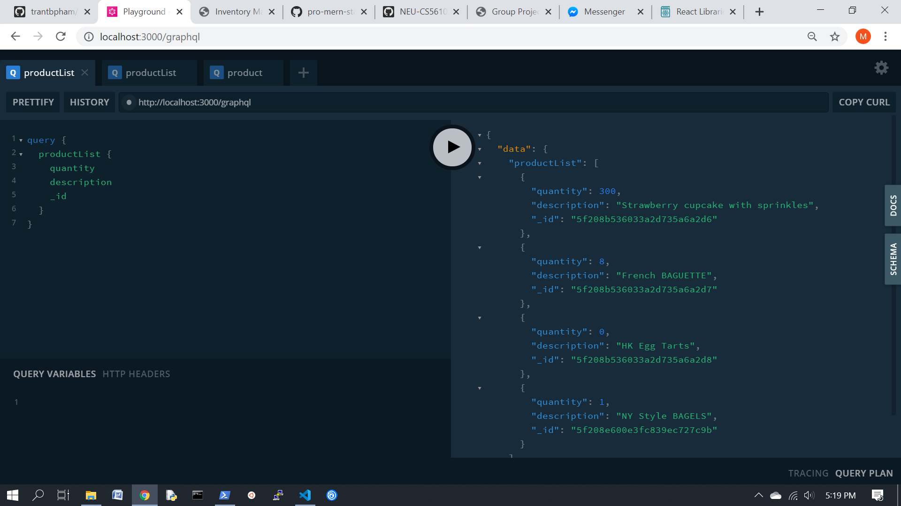
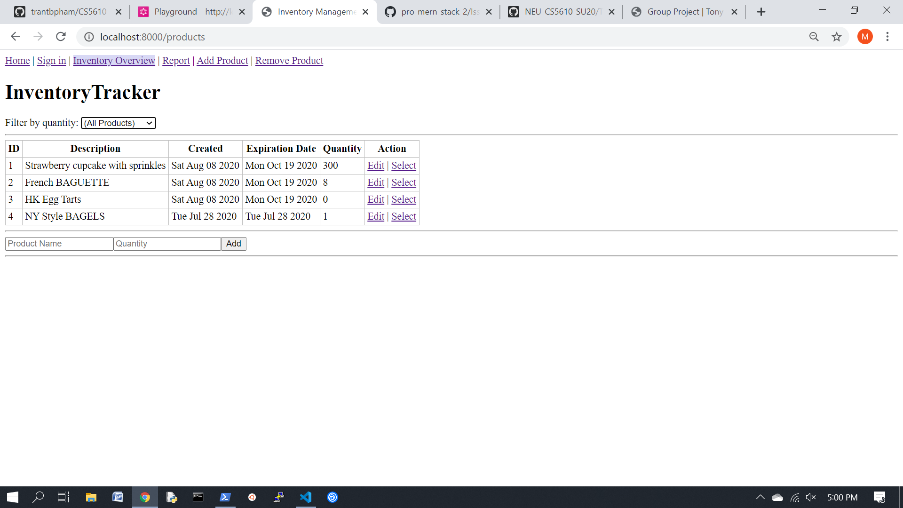

# Team Croissant: UI

## Current version: 
Iter 1.0

- Please see repo https://github.ccs.neu.edu/trantbpham/CS5610-GroupProject for all the previous commits.
## Members:
- Alice  Tilles
- Miranda Tran
- Tran Pham

## Iter 1.0 Notes:

### Screenshots:
#### API/Graphql playground:
- basic retrieval from MongoDB server

- functionality of the backend to return product(s) based on optional parameters


#### UI:
- Routing, links, and basic CRUD schema (with placeholders for delete, remove, update)

- delete (of CRUD) placeholder

- quantity filter (low stock)


### 3rd party React libraries we want to include:
- display chart/table
  - react-sortable (but it has no mobile browser support) [link](https://github.com/danielstocks/react-sortable#readme)
  - Reactable (very punny) [link](https://reactlibraries.com/library/2420ae5f-aea5-4da0-8a45-c2c64579540b)
    - this one has a fairly simplistic layout and also can sort and paginate as well
- csv / excel download
- slider [demo](https://react-smooth-range-input.now.sh/) [documentation](https://reactlibraries.com/library/1ef75821-4286-493d-8ac9-3f04b184e171)

### How to run: 
#### Localhost: 8000
```
> npm run start
```
 Dependencies (please refer to package.json for the most up-to-date libraries and versions)
    <br> * `"babel-polyfill": "^6.26.0"`,
    <br> * `"dotenv": "^6.2.0"`,
    <br> * `"express": "^4.16.4"`,
    <br> * `"http-proxy-middleware": "^0.21.0"`,
    <br> * `"nodemon": "^1.19.4"`,
    <br> * `"prop-types": "^15.7.2"`,
    <br> * `"react": "^16.13.1"`,
    <br> * `"react-dom": "^16.13.1"`,
    <br> * `"react-router-dom": "^4.3.1"`,
    <br> * `"url-search-params": "^1.1.0"`,
    <br> * `"whatwg-fetch": "^3.2.0"`

 Boilerplate starter code: 
 * Pro MERN Stack book
 * https://medium.com/@Preda/getting-started-on-building-a-personal-website-with-react-b44ee93b1710


## Member Contributions:

### Alice

### Tran
- At the beginning, I used a different boilerplate to set up the website, but then I decided to followed Pro MERN Stack 2's boilerplate starter code to set up the foundation and localhost for my teammates to work on.
- Set up node modules and any other necessary libraries for usage (express, node.js, babel, etc.)
- Set up package.json
- Set up script files (jsx & js files; html, index file)
- Set up the page structures: inventory list, inventories tables, inventories add, inventories create, inventories filter
- Other miscellaneous: set up & manage github pages 


### Miranda
#### Summary:
- I followed Pro MERN Stack 2's boilerplate starter code from chapters 7, 8, and 9.
- This involved:
  - splitting the code into separate API and UI servers (as well as directories)
  - modularizing both the front-end and back-end:
    - front-end: splitting source code into various React components (ProductAdd, InventoryTable, etc.) as well as creating other React components to represent functionality not yet implemented (delete, sign in, etc.). I added these to the navigation bar to match our lo-fi mockups
    - back-end: splitting the server code to separate the database, api, and server functionality
  - adding ESLint for front-end and back-end and fixing subsequent style violations
  - adding PropType based validation
  - installing Webpack and Hot Module Replacement functionality
  - bundling libraries and the application source code separately to avoid unnecessary recompilation
  - implementing Routing (browser based for SEO, though this is questionable if desired) and Links/NavLinks
  - adding nested routes:
    - as a departure from Pro MERN Stack 2's use of a "status" as the filter, I choose "quantity" as the factor to filter by for the filtering functionality
    - this required tracing errors where an "out-of-stock" quantity (value = 0) was returned all of the items and was solved by specifying in api/product.js to add a filter when the value was not explicitly "undefined"

## Future plans (list to dos):
- Important note: quantity is currently hardcoded as "1" due to an integer parsing error. This is done through assigning to the product when it is passed as a parameter and results in a ESLint error
- Category for products is "Other" on default and not displayed currently:
  - display on UI
  - implement filtering on Category
  - incorporate Category enums as an option when adding products
- Current schema definition for a product uses "description" when "name" is a better attribute name
- Filtering on quantity is currently hardcoded for "All products", "Low stock" (1), and "Out of Stock" (0):
  - change to filter either based on slider values, more preset values, or user-entered values
- SKU field for products
- Placeholder functionalities to be implemented: updating, creating (as a separate view), deleting, user sign-in and verification
- Separate admin privileges 


#############################
delete below when done

### Mtg Notes
* Resolving individual products product categories -> Have batch number for each group of product
* Fields required when adding a new product: Name/description, 
Optional when adding a new product: expiration date (default = 3 days or something depending on type), quantity (default = the default quantity for the category), category (default = Other, SKU
Required fields (non-null):  Name/description, created date, expiration date, quantity

TODO - add unique index on SKU
TODO - update description to name in schema.graphql

### Questions to resolve
- 
- The biggest question I have/observation is we are mixing up two different types of 'add'. There should be:

(1) Add  to database - a new product. E.g., we weren't selling scones before, and now we are.
(2) Add to database - a new batch/new inventory. E.g., we had 10 scones, baked 10 more, and now have 20 scones.

I think for this reason we need two types of CRUD:
1) Product - 
* C-Creating new products ("we now sell scones")
* U-Editing info about products ("scone is spelt sçone now")
* D-Deleting products ("we will not be selling scones at all anymore")

2) Stock -
* C-Adding stock ("just baked 12 scones")
* U-Updating stock ("the expiration date was sooner than expected...")
* D-Deleting stock ("Customer bought these 2 scones")

The **read** part of both of these will be the same place for the user probably -- the user won't conceptualize it the same way as being two different objects. Something like this:


Is the created date the created date of the product itself? Or the record? (E.g., suppose we initialize on July 1 with 10 products the store carries. Throughout the month, we stock up. Is created date July 1, or the date the products are baked?)
- Which fields are required to add a new product?
- 'Quick Add' button for a product? (default value for each type of item. E.g., clicking 'quick add' for bagels would +12 quantity on bagels, w/ current date and expiration date +1 day).
- Should we auto-increment ID? Or make our own IDs? >> autoincrement (SKU will also be unique index)
- I'm having trouble converting string (quantity) to int for the graphql query, so just automatically keeping it at 1
- Input validation?
- Are we supposed to use React CSS? Did he talk about in class how to override it so it doesn't look too much like the book project? (I'm behind) Or is it okay if it does?


### Ch 5 -6 : Stuff to note
This is an example of a graphql query that adds a new product:
```mutation {
     productAdd(product:{
   description: "New Product",
   quantity: 3,
   createdDate: "2018-12-13",
   }) { id
       quantity
       description
       createdDate
   } }
```
How to run a node script w/ mongo:
```
node scripts/trymongo.js
```

Name of the Mongo collection is inventory (replacing issueTracker).

### New Dependencies Added Ch 5
apollo-graphql -  "^0.5.0",
graphql - ^14.2.1
npm install mongodb@3


### July 23
Updated dev dependencies to match the book (this is what was causing babel present env error) -- the version were too new.

```  
"devDependencies": {
   "@babel/cli": "^7.2.3",
   "@babel/core": "^7.2.2",
   "@babel/preset-env": "^7.2.3",
   "@babel/preset-react": "^7.0.0"
 }
```


### July 20
When running `npm run watch`, encountered this error: `Error: Cannot find module '@babel/preset-env' from '/Users/alicetilles/Desktop/CS5610-GroupProject/src`.
Solution is: Run `npm install —-save-dev @babel/preset-env` and hit ok if something pops up.

```App.js:64 Uncaught ReferenceError: inventories is not defined
    at InventoryTable.render (App.js:64)
